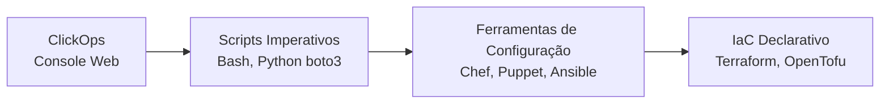

# 01_01 - Infraestrutura como Código (IaC)

## O que é Infraestrutura como Código

**Infraestrutura como Código (IaC)** é a prática de provisionar e gerenciar recursos de infraestrutura (redes, servidores, bancos de dados, permissões, DNS, etc.) através de **arquivos de texto versionáveis**, exatamente como se faz com o código-fonte de uma aplicação.

Em vez de configurar manualmente cada recurso em um console web (cliques e formulários), você **descreve o estado desejado** da infraestrutura em arquivos declarativos. Uma ferramenta (Terraform, Pulumi, CloudFormation, OpenTofu, etc.) lê essa descrição e se encarrega de chegar nesse estado na nuvem ou datacenter.

## Evolução: de cliques a IaC declarativo



1. **ClickOps**: engenheiros provisionavam tudo manualmente. Resultado: mudanças não rastreáveis, ambientes inconsistentes, difícil escalar.
2. **Scripts imperativos**: automatizamos com scripts que chamavam APIs de nuvem (AWS CLI, gcloud, boto3). Melhora, mas o script descreve **como** fazer, não **o que** existe — e rerodar pode duplicar recursos.
3. **Gerenciamento de configuração**: Ansible, Chef e Puppet padronizaram configuração de servidores (pacotes, arquivos, serviços), mas não o provisionamento inicial da infra.
4. **IaC declarativo**: você descreve **o estado final desejado**; a ferramenta calcula a diferença entre o que existe e o que foi declarado e aplica só o necessário.

## Por que IaC mudou o jogo

- **Versionamento**: arquivos `.tf`/`.yaml` vivem no Git. Toda mudança tem histórico, autor, motivo e pode ser revertida com um `git revert`.
- **Reprodutibilidade**: o mesmo código aplicado em outra conta/região cria um ambiente idêntico em minutos (ex.: replicar `dev` como `staging`).
- **Auditoria e compliance**: auditores podem inspecionar o que está declarado em vez de varrer consoles; diffs em pull requests mostram exatamente o que vai mudar antes de mudar.
- **Colaboração**: times revisam infraestrutura via code review com a mesma cerimônia do código da aplicação.
- **Velocidade segura**: `plan` mostra o impacto antes do `apply`, reduzindo medo de mexer em produção.
- **Documentação viva**: o próprio código é a descrição atualizada da infraestrutura — sem desconexão entre "o que está na wiki" e "o que está rodando".

## Declarativo vs. Imperativo

| Aspecto | Imperativo (script) | Declarativo (IaC) |
|---------|---------------------|-------------------|
| Descreve | **Como** fazer passo a passo | **O que** deve existir |
| Idempotência | Desenvolvedor precisa garantir | Garantida pela ferramenta |
| Estado | Implícito (o que está lá) | Explícito (arquivo de state) |
| Reexecução | Pode duplicar ou falhar | Converge para o estado desejado |
| Exemplo | `aws ec2 run-instances ...` | `resource "aws_instance" "web" { ... }` |

## Exemplo conceitual

Imagine que seu time precisa de um bucket S3 chamado `logs-producao-2026`. Na abordagem ClickOps, alguém entraria no console da AWS, preencheria o formulário e clicaria em "Create". Daqui a seis meses ninguém lembra quem criou, por quê, ou quais políticas foram aplicadas.

Com IaC:

```hcl
resource "aws_s3_bucket" "logs" {
  bucket = "logs-producao-2026"

  tags = {
    Dono       = "plataforma"
    Projeto    = "auditoria"
    Criado_em  = "2026-04"
  }
}
```

Esse arquivo vive no Git. Se alguém precisar entender como o bucket foi criado, basta olhar o arquivo. Se precisar criar o mesmo bucket em outra conta, basta aplicar o código lá. Se precisar deletar, basta remover o bloco e aplicar — a ferramenta cuida da remoção ordenada.

## Quando não vale a pena?

IaC tem um custo de curva de aprendizagem e manutenção. Para um servidor descartável de 5 minutos de vida, ClickOps pode ser mais rápido. Mas, para **qualquer** infraestrutura que você vá manter, revisar, replicar ou compartilhar, IaC paga o investimento muito rápido.

## Referências

- [HashiCorp: What is Infrastructure as Code?](https://www.hashicorp.com/resources/what-is-infrastructure-as-code)
- [ThoughtWorks Tech Radar — Infrastructure as Code](https://www.thoughtworks.com/radar)
- Livro: *Infrastructure as Code* — Kief Morris (O'Reilly)
