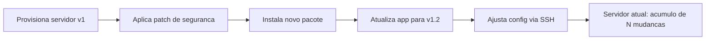

# 01_02 - Infraestrutura Mutável

## Conceito

**Infraestrutura mutável** é o modelo tradicional: você cria um servidor (VM, container, cluster) uma vez e, ao longo do tempo, **modifica-o no lugar** — aplica patches, instala pacotes novos, altera configuração, atualiza versões da aplicação. O mesmo servidor "vive" por meses ou anos acumulando mudanças.

Exemplos típicos:
- Um servidor Ubuntu em produção que recebe `apt upgrade` semanal.
- Uma VM onde você faz `git pull` para atualizar a aplicação sem recriar a máquina.
- Um banco de dados rodando direto no host, com configurações editadas via SSH quando necessário.
- Ansible aplicando playbooks repetidamente em servidores existentes para garantir estado.

## Como funciona na prática

Ou seja: um mesmo recurso passa por **N transformações ao longo do tempo**, e o "estado final" depende da ordem em que as coisas foram feitas.

## Vantagens

- **Economia de tempo aparente**: atualizar um pacote parece mais rápido do que recriar a VM inteira.
- **Baixa ruptura**: mudanças pontuais podem ser feitas sem reiniciar serviços.
- **Menos dependência de imagens prontas**: não é preciso rebuildar AMI ou container a cada mudança.
- **Compatível com workloads stateful legados** que são difíceis de mover.

## Desvantagens

- **Snowflake servers**: cada servidor vira um floco de neve único — ninguém sabe exatamente quais comandos foram rodados nele. Reproduzir em outra máquina é quase impossível.
- **Drift (desvio) de configuração**: dois servidores que começaram iguais divergem com o tempo, pois intervenções manuais são inevitáveis.
- **Rollback frágil**: desfazer uma mudança em servidor mutável geralmente exige rodar um "comando reverso" que nem sempre existe ou é seguro.
- **Debug infernal**: "funciona na máquina A mas não na B" vira uma caça ao tesouro. Logs, histórico de comandos, versão de dependência — tudo é diferente.
- **Superfície de ataque crescente**: pacotes antigos esquecidos, arquivos temporários, credenciais vazadas em `/tmp` ficam acumulando risco.
- **Escala linear com toil**: para 10 servidores ainda dá pra gerenciar; para 1000, é inviável.

## O problema dos "snowflake servers"

O termo foi popularizado por Martin Fowler. Descreve servidores **únicos, delicados, insubstituíveis** — dois servidores que deveriam ser idênticos, mas não são, porque alguém entrou via SSH uma vez e esqueceu de documentar. Quando o hardware falha, recriar o servidor do zero é arriscado porque **ninguém sabe exatamente o que havia nele**.

## Quando infraestrutura mutável ainda faz sentido

Não é pecado capital. Use quando:

- **Banco de dados em produção** sem arquitetura de réplica/migração trivial — recriar é mais arriscado que patchear.
- **Servidores físicos** (bare metal) em data centers privados onde reprovisionamento é caro e lento.
- **Ambientes de desenvolvimento pessoais** onde a sobrecarga de IaC + imagens imutáveis não compensa.
- **Sistemas legados** que não foram projetados para serem descartáveis.

## Relação com Terraform

Terraform não proíbe infraestrutura mutável: você pode declarar um `aws_instance` e, depois, alterar o `user_data` ou o tipo da instância. O Terraform vai tentar aplicar a mudança **no próprio recurso** se for um atributo mutável (`instance_type` pode ser um update), ou **destruir e recriar** se for imutável (ex.: mudar AMI gera replace).

Ou seja, o nível de mutabilidade é definido tanto pelo **provider** quanto pela **sua escolha de arquitetura** (servidor com state local vs. servidor descartável com state externo).

## Referências

- Martin Fowler — [SnowflakeServer](https://martinfowler.com/bliki/SnowflakeServer.html)
- Chef / Puppet / Ansible docs — modelos clássicos de mutabilidade controlada
