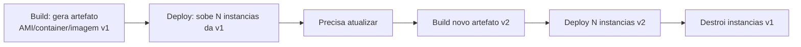

# 01_03 - Infraestrutura Imutável

## Conceito

**Infraestrutura imutável** inverte a ideia de "atualizar no lugar": em vez de modificar um recurso existente, você **cria um novo recurso com a configuração nova e destrói o antigo**. O servidor, container ou AMI nunca é "editado" em produção — ele é **substituído**.

Cada versão da infraestrutura é um artefato congelado. Se precisa mudar qualquer coisa, você gera um artefato novo e sobe. Se algo der errado, volta para o anterior.

## Analogia: gado vs. pets

Popularizada pelo engenheiro Bill Baker, a analogia é simples:

- **Pets**: você dá nome (`db-prod-01`), cuida individualmente, chama o veterinário quando adoece. Se morre, é tragédia. Esse é o modelo mutável.
- **Cattle (gado)**: cada indivíduo é numerado, sem nome próprio. Se adoece, vai para o abate; chega outro no lugar. É o modelo imutável.

Na prática, tratar servidores como gado significa: qualquer instância pode ser destruída a qualquer momento e **nada de valor se perde**, porque tudo que importa (estado, dados, configuração) vive fora dela.

## Como funciona



Ferramentas típicas:

- **Packer** (HashiCorp) para gerar AMIs, imagens GCP, Azure, Docker.
- **Docker** / **container images** como unidade imutável.
- **Terraform** para provisionar/substituir as instâncias que usam esses artefatos.
- **Blue/Green** e **rolling deploy** como estratégias de substituição sem downtime.

## Vantagens

- **Reprodutibilidade total**: a imagem `v1.2.3` gerada hoje é a mesma em qualquer ambiente, qualquer região, qualquer momento.
- **Rollback trivial**: se `v1.3` quebrou, redeploy `v1.2`. Ponto.
- **Sem config drift**: como ninguém edita instância em produção, não há divergência entre servidores que deveriam ser iguais.
- **Debug previsível**: log de `v1.3` em desenvolvimento é idêntico ao de produção, porque a imagem é a mesma.
- **Segurança**: patches viram nova imagem → novo deploy. Servidores antigos (com CVEs) morrem em vez de viverem meses esperando patch.
- **Escala horizontal natural**: subir 100 instâncias da mesma imagem é tão simples quanto subir uma.

## Desvantagens

- **Custo de build**: gerar imagens a cada mudança consome tempo e storage.
- **State precisa viver fora**: dados locais no disco da VM somem quando a VM é destruída. Exige arquitetura com storage externo (EBS/volumes persistentes, banco gerenciado, S3).
- **Curva de aprendizagem**: exige pipelines de build de imagem, estratégias de deploy (blue/green, canary), e disciplina do time.
- **Resposta a incidentes**: não dá para "entrar via SSH e ajustar rápido" — ou melhor, até dá, mas você estaria violando a premissa e criando um snowflake.

## Exemplos práticos com Terraform

**1. Uma AMI produzida por Packer consumida por Terraform**

```hcl
data "aws_ami" "app" {
  most_recent = true
  owners      = ["self"]

  filter {
    name   = "name"
    values = ["app-v*"]
  }
}

resource "aws_instance" "app" {
  ami           = data.aws_ami.app.id
  instance_type = "t3.small"
}
```

Quando o Packer gera uma AMI nova (`app-v1.2.0`), o `data` resolve para o ID novo. No próximo `terraform apply`, a instância será recriada com a AMI atualizada — infra imutável por construção.

**2. `lifecycle { create_before_destroy = true }`**

Para trocar uma instância sem downtime, criamos a nova antes de destruir a antiga:

```hcl
resource "aws_instance" "app" {
  ami           = data.aws_ami.app.id
  instance_type = "t3.small"

  lifecycle {
    create_before_destroy = true
  }
}
```

## Trade-offs: quando escolher cada modelo

| Critério | Mutável | Imutável |
|----------|---------|----------|
| Deploy em segundos | Sim | Requer pipeline |
| Rollback simples | Não | Sim |
| Escala massiva | Caro/complexo | Natural |
| Workloads stateful | Fácil | Requer storage externo |
| Segurança a longo prazo | Degrada | Se mantém |
| Debug em prod | SSH direto | Observabilidade externa |

A escolha raramente é 100/0 — equipes maduras usam **imutável para stateless** (web, API, workers) e **mutável controlado para stateful** (banco gerenciado, volumes persistentes).

## Referências

- Bill Baker / Microsoft — apresentação sobre cattle vs. pets
- HashiCorp — [Packer overview](https://developer.hashicorp.com/packer)
- Kief Morris — *Infrastructure as Code*, capítulo sobre imutabilidade
