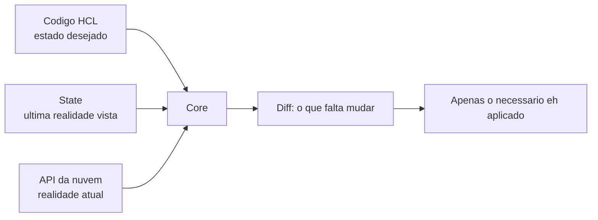

# 01_04 - Idempotência

## Definição

**Idempotência** vem da matemática: uma operação é idempotente quando aplicá-la uma vez ou mil vezes produz **exatamente o mesmo resultado**.

Formalmente, uma função `f` é idempotente se `f(f(x)) == f(x)` para qualquer `x`.

Na prática de infraestrutura, idempotência significa: **rodar o mesmo código N vezes não muda o resultado** depois que o estado desejado já foi atingido.

## Por que isso importa em IaC

Pense em um script imperativo que cria um bucket S3:

```bash
aws s3api create-bucket --bucket meu-bucket --region us-east-1
```

Executar uma vez: bucket criado. Executar de novo: erro `BucketAlreadyOwnedByYou`. O script não é idempotente. Você precisaria envolver em `if` com verificações, tratar exceções, etc.

Agora a versão Terraform:

```hcl
resource "aws_s3_bucket" "meu" {
  bucket = "meu-bucket"
}
```

Executar `terraform apply` 50 vezes seguidas sem mudar o código: nas primeiras vezes nada acontece além de ler o estado atual; não há criação duplicada, não há erro.

## Como o Terraform garante idempotência

O Terraform funciona com três "versões" da realidade:



A cada `plan`/`apply`, o Terraform:

1. Lê o **código** (estado desejado).
2. Lê o **state** (o que ele sabe que existe).
3. Faz **refresh** — consulta a nuvem para checar o que existe de fato.
4. Calcula o **diff** entre desejado e real.
5. Aplica apenas as diferenças.

Se o estado real já é igual ao desejado, o diff é vazio (`No changes. Your infrastructure matches the configuration.`). Isso é idempotência em ação.

## Operações idempotentes vs. não-idempotentes

| Operação | Idempotente? | Por quê |
|----------|:---:|---------|
| `PUT /resource/42 { name: "foo" }` (REST) | Sim | Cria se não existe, sobrescreve se existe — mesmo resultado |
| `POST /resource { name: "foo" }` | Não | Cria um novo registro a cada chamada |
| `rm -f arquivo.txt` | Sim | Falha silenciosa se o arquivo já não existe |
| `rm arquivo.txt` (sem `-f`) | Não | Erro na segunda chamada |
| `mkdir -p /tmp/foo` | Sim | Cria se não existe, não erra se existe |
| `mkdir /tmp/foo` | Não | Erro se já existe |
| `terraform apply` com código estável | Sim | Converge para o desejado |
| `aws ec2 run-instances` | Não | Cria instância nova a cada chamada |

## O papel do `plan`

`terraform plan` é a ferramenta mais poderosa que a idempotência do Terraform te oferece. Ele te mostra, **antes** de aplicar, exatamente o que vai mudar:

- `+ resource` — será criado
- `- resource` — será destruído
- `~ resource` — será modificado no lugar
- `-/+ resource` — será destruído e recriado (replace)

Se rodar `plan` e vier `No changes`, você sabe que o estado real bate com o código. Se vier diff, você sabe exatamente o que (e só o que) vai ser afetado. Isso te dá **confiança para rodar `apply` com frequência**, inclusive em automação (CI/CD), sem medo de efeitos colaterais inesperados.

## Quando a idempotência quebra

Idempotência em IaC não é mágica — ela depende do provider implementar corretamente. Casos onde pode falhar:

- **Provisioners** (`local-exec`, `remote-exec`): scripts arbitrários rodados em uma máquina. Se o script não for idempotente, o recurso também não será.
- **Null resources** com `triggers` mal definidos: podem reexecutar e gerar side effects.
- **Atributos gerados pela API** (ex.: IDs, timestamps) que mudam a cada request — podem causar "diff perpétuo".
- **Manual changes** no console (drift): alguém alterou o recurso fora do Terraform; o `plan` vai tentar reverter.

Ferramentas e técnicas para contornar:
- `lifecycle { ignore_changes = [...] }` para atributos voláteis.
- `data` sources em vez de provisioners sempre que possível.
- Pipelines CI/CD que rodam `plan` em cada PR para detectar drift.

## Exemplo prático: verificando idempotência

```bash
terraform apply -auto-approve       # primeira vez: cria recursos
terraform apply -auto-approve       # nada muda: "No changes"
terraform apply -auto-approve       # ainda nada: confirma idempotência
```

Se algum recurso aparecer no diff sem mudança de código, é sinal de provider com atributo volátil ou drift — investigar.

## Por que idempotência reduz risco

Em sistemas não-idempotentes, re-rodar é perigoso: pode duplicar dados, estourar custo, criar erros. O time evita rodar e acumula atraso.

Em sistemas idempotentes, re-rodar é seguro. Isso permite:
- **CI/CD** aplicar mudanças automaticamente sem drama.
- **Retries** em caso de falha de rede.
- **Observabilidade**: você pode rodar `plan` como health check para detectar drift.
- **Confiança para mexer em produção**.

## Referências

- [Terraform docs — Refresh](https://developer.hashicorp.com/terraform/cli/commands/refresh)
- [HTTP Method Definitions — Idempotent Methods](https://datatracker.ietf.org/doc/html/rfc9110#name-idempotent-methods)
- [Ansible docs — Idempotency](https://docs.ansible.com/ansible/latest/playbook_guide/playbooks_intro.html)
