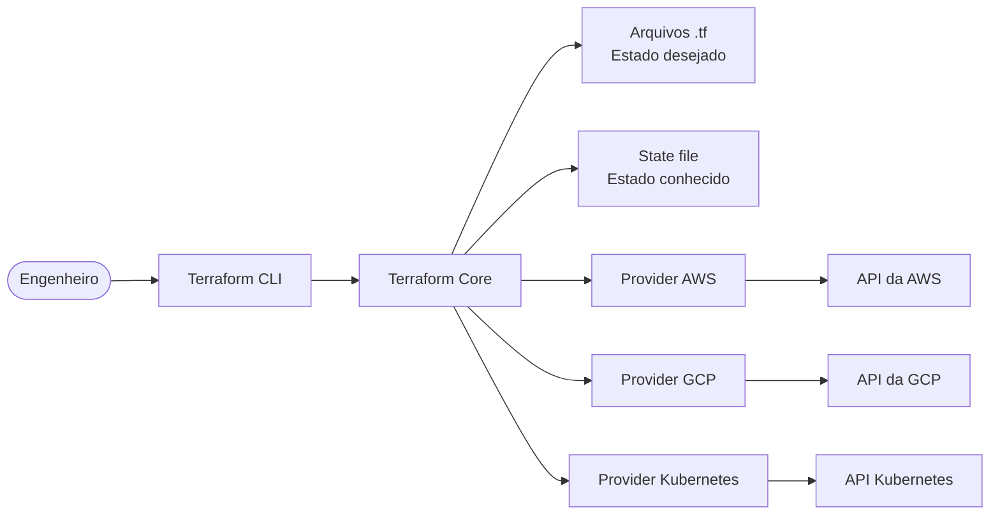
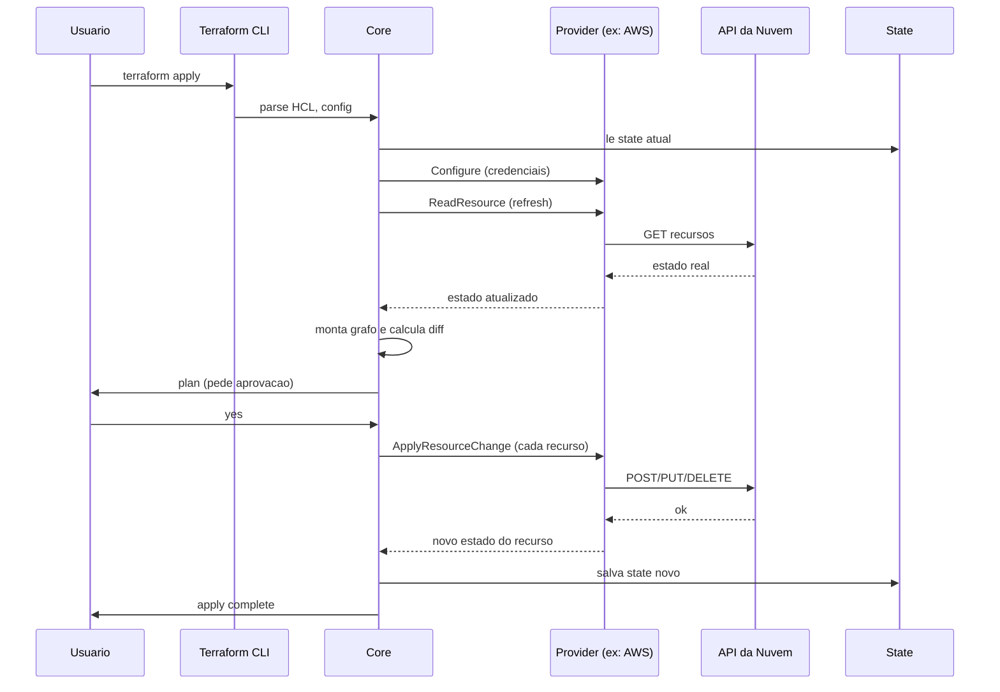

# 02_03 - Arquitetura do Terraform

## Visão geral

O Terraform é composto por **poucas partes claras** com responsabilidades bem definidas. Entender esses componentes é fundamental para diagnosticar problemas, escolher backends e saber onde cada configuração se encaixa.

## Componentes

### 1. Terraform CLI

É o binário `terraform` que você instala na sua máquina (e no CI). Ele:

- Lê argumentos (`init`, `plan`, `apply`, flags).
- Inicia o **core**.
- Imprime saída formatada no terminal.

A CLI é fina: toda a lógica de fato acontece no core.

### 2. Terraform Core

Escrito em Go, é o cérebro da ferramenta. Responsabilidades:

- **Parse e validação** do HCL.
- **Construção do grafo de dependências** entre recursos.
- **Cálculo do diff** entre código, state e realidade.
- **Orquestração** das chamadas aos providers (em paralelo quando possível).
- **Persistência** do state após modificações.

O core é **agnóstico** a qualquer nuvem — ele só conhece o protocolo de plugins.

### 3. Providers (plugins)

Cada integração com uma plataforma é implementada como um **plugin binário separado** que fala com o core via **Terraform Plugin Protocol** (atualmente gRPC).

Exemplos:

- `hashicorp/aws` — gerencia recursos AWS
- `hashicorp/google` — GCP
- `hashicorp/azurerm` — Azure
- `hashicorp/kubernetes` — clusters Kubernetes
- `integrations/github` — repositórios, times, secrets
- `datadog/datadog` — monitores, dashboards
- `cloudflare/cloudflare` — DNS, WAF

Providers são baixados durante `terraform init` e ficam em `.terraform/providers/`. O arquivo `.terraform.lock.hcl` fixa as versões para reprodutibilidade.

**Providers têm seu próprio versionamento**, independente do core. Você pode usar Terraform 1.7 com AWS provider 5.30, por exemplo.

### 4. Configurações (arquivos `.tf`)

Os arquivos `.tf` (e `.tf.json`) no diretório atual descrevem **o estado desejado**. Terraform considera todos eles juntos como uma única configuração — não existe ordem de leitura, você pode organizar como quiser.

Convenção usada neste curso:
- `main.tf` — recursos principais
- `variables.tf` — inputs
- `outputs.tf` — outputs
- `versions.tf` / `providers.tf` — bloco `terraform`, `required_providers`, `provider`
- `locals.tf` — valores calculados (opcional)

### 5. State

Arquivo (local ou remoto) que o Terraform **escreve** após cada apply. Contém o mapeamento entre cada recurso declarado no código e sua representação real na nuvem (com IDs, ARNs, atributos computados).

Formato: JSON.

Funções críticas:
- Dizer ao Terraform **o que ele já criou**.
- Permitir **refactoring** (mover, renomear recursos sem recriar).
- Servir de fonte de dados para outros módulos (via `terraform_remote_state`).

**Cuidados**:
- **NUNCA** commitar state em Git (contém IDs, às vezes segredos).
- **SEMPRE** usar backend remoto com locking em equipe.
- State desatualizado causa comportamentos estranhos — daí o `refresh` existir.

O Módulo 7 detalha state e backends.

### 6. Plugin Protocol

É o contrato gRPC entre o core e os providers. Define operações como:

- `Configure` — inicializa o provider com credenciais e região.
- `PlanResourceChange` — calcula o que mudar para um recurso.
- `ApplyResourceChange` — executa a mudança.
- `ReadResource` — lê o estado atual do recurso.

Versões atuais do protocolo (v5, v6) suportam recursos modernos como **funções** e **acoplamento desacoplado de esquemas**.

## Fluxo completo de um `terraform apply`

## Como isso te afeta no dia a dia

- **`terraform init` faz download de providers** — por isso a primeira execução é mais lenta e exige internet.
- **Providers diferentes têm qualidade diferente** — sempre leia a doc e issue tracker do provider que você usa.
- **Atualizar provider pode quebrar** — por isso `required_providers` fixa versões e o `lock file` garante reprodutibilidade.
- **State remoto é recomendação, não luxo** — trabalhar em time sem ele é pedir para quebrar.
- **Core e provider conversam via protocolo estável** — você pode atualizar providers sem atualizar Terraform e vice-versa (dentro das versões suportadas).

## Referências

- [Terraform Architecture](https://developer.hashicorp.com/terraform/internals/architecture)
- [Provider Plugin Protocol](https://developer.hashicorp.com/terraform/plugin/how-terraform-works)
- [Dependency Lock File](https://developer.hashicorp.com/terraform/language/files/dependency-lock)
