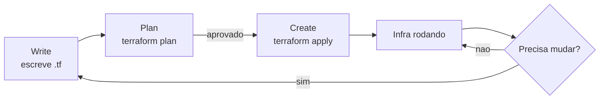

# 02_05 - Workflow do Terraform (WPC)

## O que é WPC

WPC é a sigla didática que usamos neste curso para o **ciclo fundamental de uso do Terraform**:

- **W**rite — escrever a configuração em HCL
- **P**lan — revisar o que vai mudar
- **C**reate — aplicar as mudanças (equivalente a `apply`)

Oficialmente, a HashiCorp chama esse fluxo de **Terraform workflow**. A sigla WPC é uma simplificação didática para memorização.



## Visão geral das três fases

### Write

- Você edita arquivos `.tf` no editor.
- Declara recursos, variáveis, outputs, providers.
- Salva no Git — cada alteração tem histórico e revisão.
- Ferramentas que ajudam nessa fase: autocomplete no VS Code (extensão HashiCorp), `terraform fmt` (formatação), `terraform validate` (checagem sintática).

O objetivo é que o arquivo expresse com **clareza e precisão** o que você quer.

### Plan

- Comando: `terraform plan`.
- O Terraform lê o código, o state e a nuvem.
- Calcula a **diferença** e **imprime um plano humano-legível**.
- **Nada é criado nesta fase** — é puramente descritivo.
- Pode ser salvo (`terraform plan -out=plan.tfplan`) para aplicar depois com garantia do que foi revisado.

Exemplo de saída:

```text
Terraform will perform the following actions:

  # aws_s3_bucket.logs will be created
  + resource "aws_s3_bucket" "logs" {
      + bucket = "logs-producao-2026"
      + id     = (known after apply)
    }

Plan: 1 to add, 0 to change, 0 to destroy.
```

O símbolo `+` sinaliza criação, `-` destruição, `~` modificação in-place, `-/+` destruição + recriação. Esse vocabulário é **essencial** — no Módulo 3 detalhamos.

### Create (Apply)

- Comando: `terraform apply`.
- Executa o plano: cria, modifica ou destrói recursos.
- Atualiza o state.
- Exibe resultado final e outputs declarados.

Sem flag `-auto-approve`, ele mostra o plano de novo e pede confirmação explícita (`yes`).

## Por que essa separação importa

Em ferramentas imperativas (CloudFormation pré-change sets, scripts Bash), você **dispara e reza**. No Terraform, o plan explícito te dá:

- **Revisibilidade**: o plan vira artefato de PR.
- **Previsibilidade**: nenhuma surpresa no apply — ele faz o que estava no plan.
- **Segurança em CI/CD**: pipeline roda `plan` em PR e `apply` após merge, com humano no meio.

## Comandos auxiliares do ciclo

Além dos três principais, o workflow no dia a dia inclui:

- **`terraform fmt`** — formata arquivos `.tf` conforme estilo oficial.
- **`terraform validate`** — checa se o HCL é sintaticamente válido e se referências existem.
- **`terraform init`** — baixa providers e módulos, configura backend. Obrigatório antes de qualquer plan/apply.
- **`terraform destroy`** — remove tudo. Mesma lógica: lê state, calcula o que destruir, pede confirmação.

Fluxo completo que você vai usar toda vez:

```bash
terraform init      # uma vez por diretório (ou quando muda providers)
terraform fmt       # opcional mas recomendado antes de commit
terraform validate  # rápido, vale rodar sempre antes de plan
terraform plan      # sempre antes de apply
terraform apply     # aplica as mudanças
```

E quando terminar um ambiente descartável:

```bash
terraform destroy
```

## Ciclo iterativo

O WPC não é one-shot — é **contínuo**:

1. Escreve uma mudança (nova variável, novo recurso).
2. `plan` → revisa.
3. `apply` → aplica.
4. Volta ao editor para próxima mudança.

Mudanças pequenas e frequentes > mudanças grandes e raras. Em equipe:

1. Faz branch.
2. Escreve + `plan` local.
3. Abre PR; CI roda `plan` e publica na MR.
4. Time revisa; `apply` acontece após merge (via CI).

## O que NÃO fazer

- **Editar state manualmente** (salvo casos raros com `terraform state` e backup).
- **Rodar apply direto sem plan** em produção.
- **Rodar em paralelo sem lock de state** (dois applies ao mesmo tempo corrompem state).
- **Commitar `.terraform/`, state ou `.tfvars` com segredos**.

## Para aprofundar

- Detalhes de cada comando → [Módulo 3 - Core Workflow](../03_modulo/README.md)
- Destrói e casos especiais → [Módulo 4 - Core Workflow P2](../04_modulo/README.md)
- State e backends → [Módulo 7 - States](../07_modulo/README.md)

## Referências

- [Terraform Core Workflow](https://developer.hashicorp.com/terraform/intro/core-workflow)
- [The Terraform Workflow at Scale](https://www.hashicorp.com/resources/terraform-workflow-at-scale)
