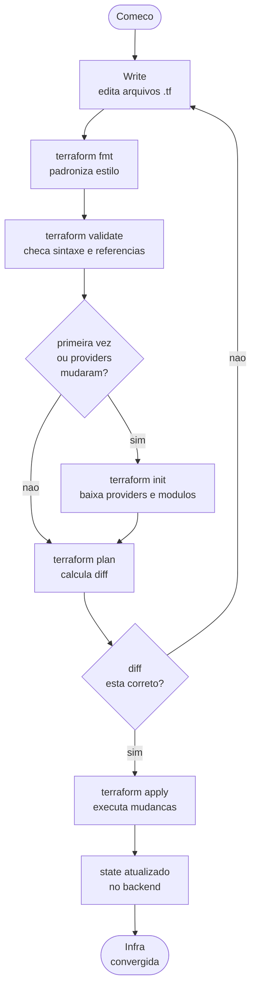
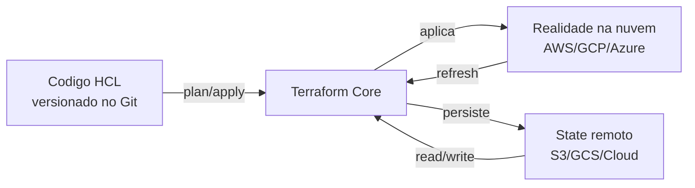

# 03_01 - Flow WPC

## Retomada do conceito

No Módulo 2 vimos que o **Workflow WPC** (Write → Plan → Create) é o ciclo fundamental. Este módulo aprofunda **cada etapa** e as ferramentas auxiliares (`fmt`, `validate`, `init`) que sustentam o workflow.

Neste tópico olhamos o ciclo em profundidade antes de detalhar os comandos individuais.

## Diagrama detalhado

## O ciclo como contrato de segurança

Cada etapa do WPC tem uma **função de segurança** específica:

| Etapa | Risco que mitiga |
|-------|-------------------|
| **Write** (+ revisão em PR) | Erro de arquitetura, código mal escrito, falta de alinhamento |
| **fmt** | Diffs barulhentos, revisão difícil por diferença de formatação |
| **validate** | Deploys que falham por erros triviais de sintaxe |
| **init** | Providers não instalados, versões inconsistentes |
| **plan** | Surpresa no apply ("não sabia que ia destruir o banco") |
| **apply** | Execução descontrolada (por isso pede confirmação) |
| **state remoto + lock** | Corrupção por dois devs aplicando ao mesmo tempo |

Pular etapas é **aceitar o risco** correspondente.

## O que está nos próximos tópicos

| Tópico | O que cobre |
|--------|-------------|
| [03_02 - Write](03_02-write.md) | Como escrever HCL limpo, organização de arquivos, convenções, Git |
| [03_03 - Validate](03_03-validate.md) | O que `terraform validate` checa (e o que não checa) |
| [03_04 - fmt](03_04-fmt.md) | Formatação automática, pre-commit, CI |
| [03_05 - Init](03_05-init.md) | Download de providers, backend, módulos, lock file |
| [03_06 - Plan](03_06-plan.md) | Leitura da saída, símbolos, plano salvo, drift |
| [03_07 - Apply](03_07-apply.md) | Aplicação, plano salvo, flags, state |

## Mapa mental do estado da infra

O Terraform orquestra **três fontes da verdade**:

1. **Código** — o que você quer.
2. **State** — o que o Terraform acha que existe.
3. **Realidade** — o que está efetivamente rodando.

Quando os três batem, nada a fazer. Quando divergem, o Terraform mostra no `plan` e resolve no `apply`.

## Dicas para dominar o ciclo

- **Automatize `fmt` + `validate` no pre-commit**: ver [tópico fmt](03_04-fmt.md).
- **Use `plan -out` em CI** para garantir que o apply aplica *exatamente* o que foi revisado.
- **`init` após qualquer mudança em `required_providers` ou `backend`**.
- **Commite `.terraform.lock.hcl`** para reprodutibilidade entre máquinas.
- **Em time, sempre backend remoto com lock**. State local só pra estudo individual.
- **Nunca rode `apply` em prod sem um `plan` revisado**.

## Quando o ciclo quebra

- **Plan vazio mas infra está errada**: provavelmente drift ou state desatualizado. `terraform apply -refresh-only` resolve.
- **Plan mostra "replace" quando você só queria modificar**: atributo é imutável no provider. Avalie se aceita downtime ou precisa de workaround.
- **`Error: Provider produced inconsistent final plan`**: bug no provider ou no seu código. Verificar versão do provider.
- **Two applies at the same time**: state corrompido. Restore do backup e lock no backend.

Esses cenários são normais em vida real; nos próximos tópicos você vai desenvolver o vocabulário para lidar com eles.

## Referências

- [Terraform Core Workflow](https://developer.hashicorp.com/terraform/intro/core-workflow)
- Tópico [02_05 - Workflow WPC](../02_modulo/02_05-workflow-wpc.md) (visão introdutória)
