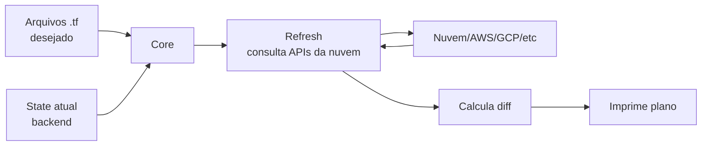

# 03_06 - Plan

## O que faz

`terraform plan` calcula o **diff** entre o código Terraform, o state e a realidade na nuvem, e imprime **exatamente** o que o próximo `apply` vai fazer.

**Crucialmente, não altera nada.** É uma operação read-only.

```bash
terraform plan
```

## Fluxo interno



1. Terraform lê o código.
2. Lê o state.
3. **Refresh**: consulta as APIs para ver o estado real de cada recurso (pode ser desligado com `-refresh=false`).
4. Calcula a diferença.
5. Imprime o plano.

## Lendo a saída

Símbolos importantes:

| Símbolo | Significado |
|---------|-------------|
| `+` | Recurso será **criado**. |
| `-` | Recurso será **destruído**. |
| `~` | Recurso será **modificado in-place** (atributo mutável). |
| `-/+` | Recurso será **destruído e recriado** (atributo imutável). |
| `<=` | Recurso será **lido** (só para `data` sources). |
| Nada | Nenhuma mudança. |

### Exemplo de criação

```text
Terraform will perform the following actions:

  # aws_s3_bucket.logs will be created
  + resource "aws_s3_bucket" "logs" {
      + arn                         = (known after apply)
      + bucket                      = "logs-prod-2026"
      + force_destroy               = false
      + id                          = (known after apply)
      + tags_all                    = {
          + "Ambiente" = "producao"
        }
    }

Plan: 1 to add, 0 to change, 0 to destroy.
```

`(known after apply)` = valor que a nuvem vai gerar (ID, ARN).

### Exemplo de modificação

```text
  # aws_instance.web will be updated in-place
  ~ resource "aws_instance" "web" {
        id            = "i-0abc123"
      ~ instance_type = "t3.micro" -> "t3.small"
        # (outros atributos inalterados omitidos)
    }

Plan: 0 to add, 1 to change, 0 to destroy.
```

`~` indica update in-place. Rápido, sem downtime.

### Exemplo de replace

```text
  # aws_instance.web must be replaced
-/+ resource "aws_instance" "web" {
      ~ ami           = "ami-0123" -> "ami-0456" # forces replacement
        id            = "i-0abc123" -> (known after apply)
    }

Plan: 1 to add, 0 to change, 1 to destroy.
```

`-/+` significa destruir e recriar. Pode causar downtime — atenção!

### Exemplo "no changes"

```text
No changes. Your infrastructure matches the configuration.

Terraform has compared your real infrastructure against your configuration
and found no differences, so no changes are needed.
```

Idempotência em ação.

## Plano salvo (`-out`)

Em pipelines e produção, **salvar o plano** é essencial:

```bash
terraform plan -out=plan.tfplan
```

E depois aplicar exatamente aquele plano:

```bash
terraform apply plan.tfplan
```

Benefícios:

- O apply **não recalcula** — executa exatamente o que foi revisado.
- Você garante que **entre plan e apply** ninguém mudou nada (drift).
- Em pipeline CI/CD, o arquivo `.tfplan` é um artefato que viaja entre estágios de `plan` e `apply`.

**Importante**: o `.tfplan` é binário e contém valores resolvidos (incluindo segredos). **Não commitar** e tratar como artefato sensível.

## Flags úteis

| Flag | Uso |
|------|-----|
| `-out=FILE` | Salva o plano. |
| `-var="k=v"` | Define variável. |
| `-var-file=FILE` | Carrega `.tfvars`. |
| `-target=ADDR` | Planeja só um recurso. Cuidado: quebra a visão global. |
| `-destroy` | Planeja destruição. |
| `-refresh=false` | Pula o refresh (mais rápido; menos preciso). |
| `-refresh-only` | Só atualiza o state, não propõe mudanças. |
| `-detailed-exitcode` | Exit codes: 0=sem diff, 1=erro, 2=com diff. |
| `-parallelism=N` | N recursos consultados em paralelo no refresh (default 10). |
| `-json` | Saída em JSON (parsável). |
| `-no-color` | Sem cores, CI. |

## Drift detection

"Drift" é quando a realidade diverge do state. Acontece quando alguém muda no console, por exemplo.

- `terraform plan` (com refresh ligado por padrão) **detecta** drift.
- Se alguém mudou a tag de uma EC2 no console, o plan mostra `~` revertendo.
- `terraform apply -refresh-only` sincroniza o state com a realidade **sem propor mudanças de código**.

Time maduro roda `plan` periodicamente (via cron/CI) só para detectar drift e alertar.

## Exit codes úteis em CI

```bash
terraform plan -detailed-exitcode -out=plan.tfplan
case $? in
  0) echo "Sem mudanças" ;;
  1) echo "Erro" ; exit 1 ;;
  2) echo "Há mudanças — aguardando apply" ;;
esac
```

Com `-detailed-exitcode`, você consegue lógica condicional em pipelines.

## Saída em JSON

```bash
terraform plan -out=plan.tfplan
terraform show -json plan.tfplan > plan.json
```

Permite **políticas** programáticas: verificar se há recursos sendo destruídos, se certos tipos estão sendo criados, etc. Ferramentas como **OPA** e **Conftest** consomem esse JSON.

## Limitações

- **Plan nem sempre acerta 100%**: provider pode não conseguir prever certos valores.
- **Alguns erros só aparecem no apply**: quotas, conflito de nomes, permissões.
- **Refresh pode ser lento** em projetos grandes (muitos recursos = muitas chamadas à API).
- **`-target` confunde** o grafo de dependências; use só em emergências.

## Boas práticas

- **Sempre rode `plan` antes de `apply`** em ambientes reais.
- **Salve o plano com `-out`** em CI/CD.
- **Revise o número de recursos afetados** — "destroy 47 resources" em prod é sinal vermelho.
- **Procure por `-/+`** em recursos stateful (banco, storage, DNS) — podem causar perda de dados.
- **Não ignore `~ tags_all`** — muitas vezes é mudança involuntária que o time deve entender.

## Referências

- [terraform plan](https://developer.hashicorp.com/terraform/cli/commands/plan)
- [Refresh-only mode](https://developer.hashicorp.com/terraform/cli/commands/refresh)
- [OPA + Terraform](https://www.openpolicyagent.org/docs/latest/terraform/)
