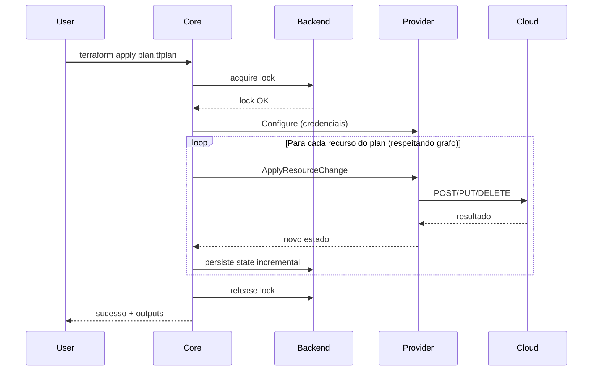

# 03_07 - Apply

## O que faz

`terraform apply` **executa** as mudanças calculadas pelo plan: cria, modifica ou destrói recursos na nuvem, e atualiza o state.

```bash
terraform apply
```

Sem flags adicionais, ele:

1. Roda um `plan` internamente.
2. Mostra o plano.
3. Pede confirmação (`yes` ou `no`).
4. Executa.
5. Atualiza o state.

## Modos de uso

### Ad-hoc (plan + apply em um comando)

```bash
terraform apply
```

Útil em desenvolvimento local. O Terraform mostra o plan e pede confirmação.

### Plano salvo (modo auditável)

```bash
terraform plan -out=plan.tfplan
# ... revisa em PR ...
terraform apply plan.tfplan
```

Apply executa **exatamente** o plano previamente salvo, sem recalcular. Garante que o apply aplica o que foi aprovado.

Em CI/CD é o modo **recomendado**.

### Não-interativo (CI)

```bash
terraform apply -auto-approve
```

Sem prompt. Use em pipelines que já têm aprovação humana em outro lugar (merge request, manual approval).

## Flags importantes

| Flag | Uso |
|------|-----|
| `-auto-approve` | Não pede confirmação. |
| `-var="k=v"` | Define variável. |
| `-var-file=FILE` | Carrega `.tfvars`. |
| `-target=ADDR` | Aplica só um recurso. Cuidado. |
| `-replace=ADDR` | Força substituição de um recurso (substitui `taint`). |
| `-refresh=false` | Pula refresh (não recomendado em prod). |
| `-refresh-only` | Só atualiza state, não muda recursos. |
| `-parallelism=N` | Recursos em paralelo (default 10). |
| `-input=false` | Sem prompt nenhum (CI). |
| `-no-color` | Sem cores (CI). |
| `-json` | Saída em JSON. |

## Exemplo de saída

```text
aws_s3_bucket.logs: Creating...
aws_s3_bucket.logs: Creation complete after 3s [id=logs-prod-2026]
aws_s3_bucket_versioning.logs: Creating...
aws_s3_bucket_versioning.logs: Creation complete after 1s

Apply complete! Resources: 2 added, 0 changed, 0 destroyed.

Outputs:

bucket_arn = "arn:aws:s3:::logs-prod-2026"
```

## O que acontece no apply



Pontos importantes:

- **Lock** do state no início para impedir apply concorrente.
- **Grafo de dependências** determina a ordem (paralelismo controlado).
- **State é atualizado incrementalmente** — se o apply cair no meio, o state reflete o que foi feito até ali.
- **Outputs** são impressos no final.

## Paralelismo

Por padrão, o Terraform cria até **10 recursos em paralelo** (respeitando dependências).

```bash
terraform apply -parallelism=20    # mais rápido, cuidado com rate limit
terraform apply -parallelism=1     # serial, útil para debug
```

## Falhas durante apply

Se um recurso falha em criar/alterar:

- O Terraform **para a execução** (por padrão).
- Recursos já processados ficam no state.
- Você pode **corrigir o problema** e rodar `apply` de novo.
- O state consistente garante que só o que faltava será aplicado.

Em situações extremas, pode ser necessário:

- **`terraform state rm`** para remover entrada corrompida.
- **`terraform import`** para trazer recurso real de volta ao state.
- **Restore de backup do state**.

## Substituindo recursos (`-replace`)

Quando você quer **forçar destroy + create** de um recurso específico (ex.: uma VM corrompida):

```bash
terraform apply -replace="aws_instance.web"
```

Isso substitui o antigo `terraform taint` (depreciado desde 0.15).

## Aplicando só parte (`-target`)

Em emergência:

```bash
terraform apply -target="aws_s3_bucket.logs"
```

Aplica apenas esse recurso e suas dependências. **Use com moderação** — quebra a premissa de "todo o código está refletido no state".

Casos em que é legítimo:

- Recuperar de um erro parcial.
- Aplicar um hotfix urgente enquanto o resto do plan está em revisão.

Casos em que é **ruim**:

- Evitar resolver drift (sempre vai voltar).
- Fugir de uma refatoração dolorida.

## Outputs

Após o apply, valores declarados em `output` são impressos e ficam disponíveis via:

```bash
terraform output                    # todos
terraform output bucket_arn         # específico
terraform output -json              # JSON para parsing
terraform output -raw bucket_arn    # valor puro (ideal para scripts)
```

## State remoto e lock

Em produção, **use backend remoto com locking**. Sem lock:

- Dois engenheiros aplicando ao mesmo tempo = state corrompido.
- CI e humano aplicando simultaneamente = caos.

Com lock (S3 + DynamoDB, GCS com locking, etc.), o segundo apply **espera ou falha** com mensagem clara.

Se um lock ficar travado (processo morreu), você pode forçar:

```bash
terraform force-unlock <LOCK_ID>
```

Obtenha o LOCK_ID na mensagem de erro. **Use com cuidado**.

## Apply em CI/CD

Padrão recomendado:

```yaml
plan:
  script:
    - terraform init
    - terraform plan -out=plan.tfplan
  artifacts:
    paths:
      - plan.tfplan

apply:
  script:
    - terraform init
    - terraform apply -auto-approve plan.tfplan
  when: manual  # ou automático com branch protegida
  needs:
    - plan
```

O artefato `plan.tfplan` garante que o apply aplica exatamente o que foi revisado.

## Riscos e mitigação

- **Destroy acidental**: sempre revise `destroy X resources` no plan antes de aprovar.
- **Timeouts**: provider pode ter timeout default baixo. Configure `timeouts { create = "30m" }` no recurso se necessário.
- **Rate limiting** da API da nuvem: reduza `-parallelism`.
- **Mudança com downtime**: `-/+` em recursos stateful pode quebrar produção. Planeje janelas.

## Referências

- [terraform apply](https://developer.hashicorp.com/terraform/cli/commands/apply)
- [-replace](https://developer.hashicorp.com/terraform/cli/commands/plan#replace-address)
- [State Locking](https://developer.hashicorp.com/terraform/language/state/locking)
