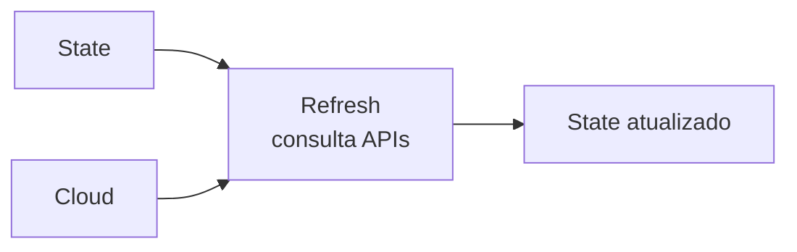

# 04_04 - Refresh e Drift Detection

## Conceitos

- **State**: o que o Terraform **acha** que existe na nuvem.
- **Realidade**: o que de fato existe.
- **Drift**: divergência entre os dois (alguém mudou no console, recurso foi deletado fora do TF, etc.).
- **Refresh**: operação que lê a realidade e atualiza o state.



## Drift: como acontece

Situações comuns:

- **Hotfix manual**: alguém entra no console e altera um security group porque está "quebrando prod agora".
- **Outra ferramenta**: Ansible/CloudFormation alterando recursos que o Terraform também gerencia.
- **Deleção acidental**: recurso foi deletado fora do Terraform.
- **Mudanças automáticas**: provider muda a forma de representar algo; atributo passa a existir.

## Como detectar drift

### 1. `terraform plan` (padrão)

Por padrão, `terraform plan` **roda refresh automaticamente** e, se houver drift, mostra no diff:

```text
# aws_security_group.web has been changed
~ resource "aws_security_group" "web" {
    ~ description = "Old desc" -> "Changed in console"
}

Unless you have made equivalent changes to your configuration, Terraform will reconcile this on the next apply.
```

O plan pode propor **reverter** a mudança manual (trazendo de volta o que está no código).

### 2. `terraform refresh`

**Depreciado** em favor de `terraform apply -refresh-only`. Ainda funciona:

```bash
terraform refresh
```

Atualiza o state **sem planejar mudanças**. Útil para forçar sincronia antes de inspecionar.

### 3. `terraform apply -refresh-only`

Modo moderno, mais seguro:

```bash
terraform apply -refresh-only
```

Terraform pergunta: "a realidade mudou, quer atualizar o state para refletir?". Você responde `yes`, e o state fica sincronizado **sem alterar nada na nuvem**.

Use quando:

- Detectou drift e quer aceitar a realidade (não reverter).
- Alguém deletou um recurso fora do Terraform e você quer remover do state sem tentar recriar.

## Exemplo de fluxo

### Cenário: alguém mudou a tag de uma EC2 no console

Seu código declara:
```hcl
resource "aws_instance" "web" {
  # ...
  tags = {
    Ambiente = "prod"
  }
}
```

Um colega mudou no console para:
```text
tags = {
  Ambiente = "staging"
  HotFix = "true"
}
```

### Opção A: reverter para o código (default)

```bash
terraform plan
# mostra: tags serão revertidas para Ambiente=prod
terraform apply
# reverte as tags na nuvem
```

### Opção B: aceitar a realidade

```bash
terraform apply -refresh-only
# state é atualizado, código continua com Ambiente=prod
```

Depois você deve **atualizar o código** para refletir a nova realidade; senão, o próximo `plan` vai querer reverter de novo.

## Flag `-refresh=false`

```bash
terraform plan -refresh=false
```

Pula o refresh. Mais rápido, mas o plan pode ser **baseado em state desatualizado**.

Use com cuidado:

- **OK** em ambientes onde você sabe que nada mudou manualmente.
- **OK** para plans super rápidos em dev.
- **EVITE** em produção.

## Refresh em projetos grandes

Em projetos com centenas de recursos, o refresh pode levar minutos. Estratégias:

### Aumentar paralelismo (cuidado com rate limits)

```bash
terraform plan -parallelism=30
```

### Separar em módulos/workspaces menores

Dividir infraestrutura em várias "stacks" (cada uma com seu state) reduz tempo de refresh por stack.

### CI agendado pra detectar drift

```yaml
# Exemplo GitLab CI
drift-detection:
  schedule: "0 6 * * *"  # todo dia 6h
  script:
    - terraform init
    - terraform plan -detailed-exitcode -out=plan.tfplan
    - |
      case $? in
        0) echo "Sem drift" ;;
        2) echo "Drift detectado" ; notify-slack.sh ;;
      esac
```

Empresa madura **roda plan diariamente** para saber sobre drift antes que vire emergência.

## Quando refresh "falha"

- **API inacessível**: credentials expiraram, rede, quota — refresh não consegue ler. O plan vai com state desatualizado.
- **Recurso deletado fora do TF**: provider reporta 404; Terraform remove do state (ou propõe recriar, dependendo do provider).

## Drift vs. Plan vs. State

| Conceito | O que é |
|----------|---------|
| **Drift** | Realidade != State |
| **Plan diff** | Código != State (+ refresh traz a realidade) |
| **State** | Snapshot do que o Terraform "conhece" |
| **Realidade** | O que existe na nuvem agora |

Um bom plan = drift detectado + diff de código. Com isso, você sabe exatamente o que acontece no apply.

## Boas práticas

- **Não desligue refresh** em prod (a menos que tenha motivo forte).
- **Documente quem tem permissão de mexer fora do Terraform**. O ideal é ninguém; realisticamente, SREs em emergência.
- **Audite drift regularmente** via CI.
- **Use `-refresh-only`** para sincronizar state com realidade sem surpresas.
- **Atualize o código** sempre que aceitar drift — senão o próximo plan traz tudo de volta.

## Referências

- [terraform refresh](https://developer.hashicorp.com/terraform/cli/commands/refresh)
- [apply -refresh-only](https://developer.hashicorp.com/terraform/cli/commands/plan#refresh-only-mode)
- [Manage Resource Drift](https://developer.hashicorp.com/terraform/tutorials/state/resource-drift)
