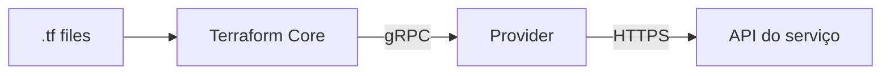

# 06_01 - O que são Providers

## Definição

**Provider** é o plugin que faz a ponte entre o Terraform Core e a API de um serviço (AWS, GCP, Azure, Kubernetes, GitHub, Datadog, etc.). Sem provider, o Terraform não sabe falar com nada — ele é apenas um motor de grafo e state.



O provider traduz:

- **Blocos HCL** (`resource "aws_s3_bucket"`) → chamadas de API (`CreateBucket`).
- **Respostas da API** → atributos disponíveis em HCL (`aws_s3_bucket.logs.arn`).

## O que um provider faz

1. **Define os tipos de recursos** (`resource`) e data sources (`data`) disponíveis.
2. **Valida** os argumentos em tempo de plan.
3. **Executa** operações CRUD contra a API.
4. **Calcula drifts** durante `refresh`.
5. **Informa ao Core** quais atributos existem e como se comportam.

## Exemplo mínimo

```hcl
terraform {
  required_providers {
    aws = {
      source  = "hashicorp/aws"
      version = "~> 5.0"
    }
  }
}

provider "aws" {
  region = "us-east-1"
}

resource "aws_s3_bucket" "logs" {
  bucket = "minha-empresa-logs-2026"
}
```

Três partes:

- **`required_providers`**: declara quais providers o projeto usa.
- **`provider "aws" { ... }`**: configura o provider (região, credenciais, etc.).
- **Recursos** que pertencem ao provider (`aws_*`, `google_*`, `kubernetes_*`).

## Tipos de providers (por mantenedor)

| Tier | Descrição | Exemplos |
|------|-----------|----------|
| **Official** | Mantidos pela HashiCorp | `hashicorp/aws`, `hashicorp/azurerm`, `hashicorp/google`, `hashicorp/kubernetes`, `hashicorp/random`, `hashicorp/null`, `hashicorp/tls` |
| **Partner** | Mantidos por empresas parceiras, com badge de verificação | `cloudflare/cloudflare`, `datadog/datadog`, `gitlab/gitlab`, `newrelic/newrelic` |
| **Community** | Mantidos pela comunidade, sem SLA | Diversos (`carlpett/sops`, etc.) |
| **Archived** | Descontinuados | Não devem ser usados em novos projetos |

Fonte confiável: [Terraform Registry](https://registry.terraform.io/browse/providers).

## Origem (`source`)

O `source` tem o formato `[HOSTNAME/]NAMESPACE/TYPE`:

- `hashicorp/aws` → `registry.terraform.io/hashicorp/aws` (implícito).
- `cloudflare/cloudflare` → `registry.terraform.io/cloudflare/cloudflare`.
- `my-company.example.com/infra/mycloud` → registry privado.

Namespaces explícitos reduzem ambiguidades e permitem uso de registries privados (Terraform Cloud, Artifactory, GitLab Package Registry).

## Versão (`version`)

Sempre especifique uma versão. Restrições suportadas:

| Operador | Significado | Exemplo |
|----------|-------------|---------|
| `=` ou sem | Versão exata | `"5.10.0"` |
| `!=` | Excluir versão | `"!= 5.11.0"` |
| `>` `>=` `<` `<=` | Maior/menor | `">= 5.10.0"` |
| `~>` | "Pessimistic": aceita patch/minor | `"~> 5.10"` → 5.10.x até < 6.0 |

O **lock file** (`.terraform.lock.hcl`) grava qual versão exata foi escolhida. Commite esse arquivo.

```hcl
# Aceita 5.x (qualquer minor/patch da 5)
version = "~> 5.0"

# Aceita 5.10.x (só patch)
version = "~> 5.10"

# Intervalo explícito
version = ">= 5.0, < 6.0"
```

## O que um provider NÃO faz

- Não executa comandos no sistema operacional (use `local-exec` com cuidado).
- Não gerencia estado (isso é do Core).
- Não conhece outros providers (cada um é isolado).
- Não corrige APIs inconsistentes (comportamentos estranhos da AWS/GCP aparecem no Terraform).

## Ecossistema

Há **mais de 3.000 providers** no Registry. Os mais comuns em projetos reais:

| Provider | Uso |
|----------|-----|
| `aws`, `google`, `azurerm` | Hyperscalers |
| `kubernetes`, `helm` | Clusters k8s |
| `github`, `gitlab`, `bitbucket` | SCM e CI |
| `datadog`, `grafana`, `newrelic` | Observabilidade |
| `cloudflare`, `aws_route53` | DNS/CDN |
| `vault` | Segredos |
| `random`, `null`, `tls`, `time`, `local`, `archive` | Utilitários |

## Providers utilitários importantes

- **`random`** — gera valores aleatórios (senhas, sufixos).
- **`null`** — recursos "nulos" para efeitos colaterais (`triggers`).
- **`tls`** — gera chaves e certificados.
- **`time`** — offsets temporais, sleeps.
- **`local`** — arquivos locais (leitura/escrita).
- **`archive`** — zip/tar para Lambda, Cloud Functions.

```hcl
resource "random_password" "db" {
  length  = 24
  special = true
}

resource "aws_db_instance" "this" {
  # ...
  password = random_password.db.result
}
```

## Resumo

- Provider = plugin que conecta Terraform a uma API.
- Declare em `required_providers`, configure em `provider`, use em `resource` e `data`.
- Sempre fixe versões com `~>` ou intervalos explícitos.
- Commite o `.terraform.lock.hcl`.

No próximo tópico, detalhamos o **bloco `required_providers`**, suas nuances e padrões.
