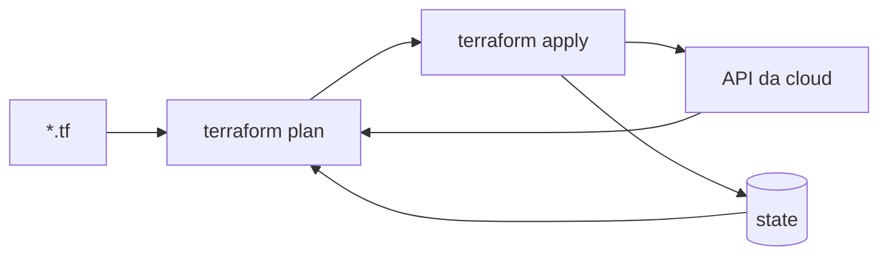

# 07_01 - O que é o State

## Definição

**State** é a representação persistente do que o Terraform criou no mundo real. É um arquivo JSON (`terraform.tfstate`) onde Terraform registra:

- Cada recurso declarado → seu **ID real** na cloud.
- **Atributos** retornados pela API (ARNs, IPs, timestamps).
- **Dependências** calculadas.
- **Metadata**: versão do Terraform, providers, serial de mudanças.

Sem state, o Terraform não sabe **o que já existe**. Toda vez que rodasse, acharia que precisa criar tudo do zero.

## Para que serve

1. **Mapeamento lógico → real**: liga `aws_instance.web` a `i-0123456789abcdef`.
2. **Performance**: evita consultar toda a API a cada run.
3. **Rastreamento**: detecta drift ao comparar state com realidade.
4. **Dependências**: cache do grafo calculado.
5. **Colaboração**: compartilhado entre membros/CI via backend remoto.
6. **Metadados sensíveis**: retorna senhas/tokens que os providers geram.

## Exemplo resumido

Código:

```hcl
resource "aws_s3_bucket" "logs" {
  bucket = "logs-2026"
}
```

State (simplificado):

```json
{
  "version": 4,
  "terraform_version": "1.9.0",
  "serial": 3,
  "lineage": "abc-123-...",
  "resources": [
    {
      "mode": "managed",
      "type": "aws_s3_bucket",
      "name": "logs",
      "provider": "provider[\"registry.terraform.io/hashicorp/aws\"]",
      "instances": [
        {
          "schema_version": 0,
          "attributes": {
            "id": "logs-2026",
            "bucket": "logs-2026",
            "arn": "arn:aws:s3:::logs-2026",
            "tags": { "Env": "prod" }
          }
        }
      ]
    }
  ]
}
```

O Terraform lê esse JSON e sabe que `aws_s3_bucket.logs` corresponde ao bucket `logs-2026`.

## Ciclo de vida do state

1. Você roda `terraform apply`.
2. Terraform cria/altera recursos via API.
3. Provider retorna **IDs e atributos**.
4. Terraform atualiza **em memória** e grava no backend.
5. No próximo `plan`, ele lê o state, faz `refresh`, e compara com o código.



## Local vs. remoto

### Local (`backend "local"`)

O state fica em `./terraform.tfstate` no diretório do projeto.

- **Pró**: simples, zero setup.
- **Contra**: não colabora (um dev trava o outro), pode ir pro Git por engano, sem lock.

**Use apenas** para:
- Experimentos.
- Projetos pessoais não-compartilhados.
- Curso/estudo.

### Remoto (S3, GCS, HTTP, Terraform Cloud, etc.)

State em um backend central. Detalhes em [07_03 - Backends](07_03-backends.md).

## `terraform.tfstate.backup`

Terraform mantém um **backup da versão anterior** sempre que escreve no state. Útil para rollback manual em desastres.

## Partes sensíveis

State contém:

- Senhas geradas por providers (RDS, password_policies).
- Tokens.
- Conteúdo de `sensitive` variables.

Ou seja, **state tem secrets**. Sempre armazene em backend com:

- **Encryption at rest**.
- **Controle de acesso** (IAM).
- **Auditoria** de leitura/escrita.

## Regras de ouro

1. **Nunca commite `terraform.tfstate`** no Git.
2. **Sempre use backend remoto** em times/CI.
3. **Sempre use state locking** (S3+DynamoDB, GCS, etc.).
4. **Sempre criptografe** em repouso e em trânsito.
5. **Evite editar state à mão** — use `terraform state ...`.
6. **Mantenha backup** antes de operações destrutivas.

## Quando o state corrompe

Sintomas:
- `Error: state file corrupted`.
- Recursos fantasmas (no state, apagados na cloud).
- Duplicações (recurso criado 2x).
- Drift permanente após apply.

Recuperação:
- Restaurar `terraform.tfstate.backup`.
- Para backends versionados (S3+versioning), voltar para versão anterior.
- Em último caso, `terraform state rm` + `terraform import`.

## `.gitignore` recomendado

```gitignore
# Arquivos do Terraform
*.tfstate
*.tfstate.*
*.tfvars
.terraform/
.terraform.tfstate*
crash.log
crash.*.log

# Lock file (committed)
!.terraform.lock.hcl
```

## Resumo

- State é a **cola** entre código declarativo e realidade na nuvem.
- É sensível, crítico e precisa de cuidados.
- Em qualquer projeto sério: **backend remoto com lock e criptografia**.

Próximo tópico: **state local** em profundidade (quando ainda faz sentido).
