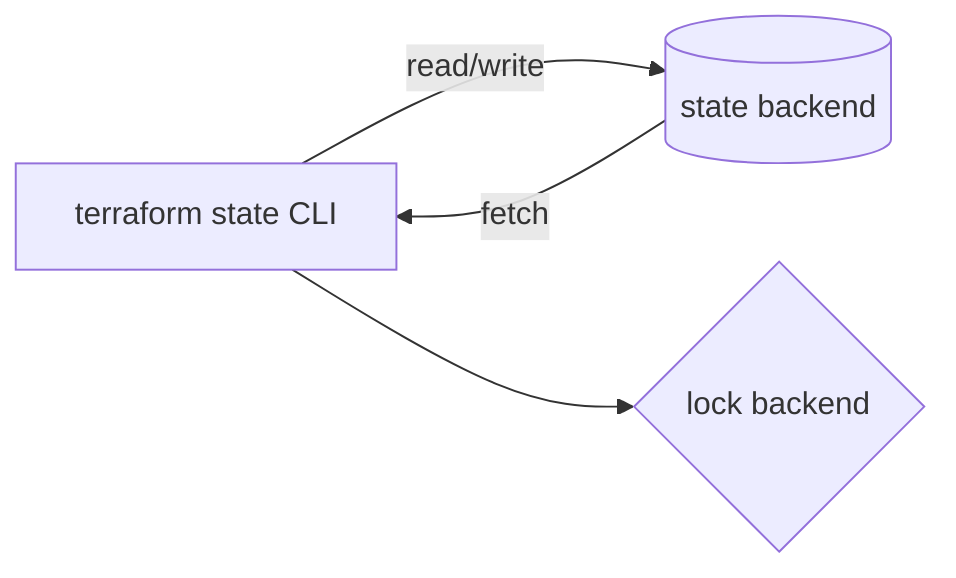

# 07_06 - Operações de State (revisão prática)

O Módulo 4 já introduziu `terraform state list`, `show`, `mv`, `rm`, `pull`, `push`. Aqui consolidamos o ciclo completo com foco em **backend remoto**.

## Fluxo padrão



Todas as operações passam pelo backend e respeitam o lock.

## `terraform state list`

Lista os recursos no state:

```bash
terraform state list
```

Saída típica:

```
aws_instance.web
aws_s3_bucket.logs
module.vpc.aws_vpc.this
module.vpc.aws_subnet.public[0]
module.vpc.aws_subnet.public[1]
```

Filtros:

```bash
terraform state list 'module.vpc.*'
terraform state list 'aws_instance.*'
```

## `terraform state show`

Detalhes de um recurso:

```bash
terraform state show aws_s3_bucket.logs
```

Mostra atributos (incluindo sensíveis, se você tem permissão). Útil para:

- Verificar atributos computed.
- Confirmar tags/IDs antes de refactor.
- Obter ARN para documentar.

## `terraform state mv`

Move um recurso de um endereço a outro (sem mexer na cloud):

```bash
# Refatorei: antes aws_s3_bucket.logs, agora module.storage.aws_s3_bucket.logs
terraform state mv aws_s3_bucket.logs module.storage.aws_s3_bucket.logs
```

Casos comuns:

- Extrair recursos para um módulo.
- Renomear (`foo` → `bar`).
- Mover entre states (via `pull`/`push`, ver abaixo).

**Boa prática**: a partir do Terraform 1.1, prefira o **bloco `moved`**:

```hcl
moved {
  from = aws_s3_bucket.logs
  to   = module.storage.aws_s3_bucket.logs
}
```

Isso é parte do código, commitado, e o Terraform aplica no próximo plan. Zero comando manual.

## `terraform state rm`

Remove um recurso do state sem destruir o objeto na cloud:

```bash
terraform state rm aws_instance.legacy
```

Quando usar:

- Recurso passou a ser gerenciado fora do Terraform.
- Você vai re-importar com outro address.
- Experimentos.

**Cuidado**: rodar `apply` depois de remover sem importar cria duplicata.

## `terraform state pull` / `push`

Baixa/sobe o state inteiro:

```bash
# Salvar cópia atual
terraform state pull > state-backup.json

# Reescrever state (perigoso, faça backup antes!)
terraform state push state-backup.json
```

Usos:

- Backup pontual antes de mudança arriscada.
- Migração entre backends.
- Investigação forense (analisar state fora do Terraform).

Exemplo de migração:

```bash
# Backend antigo ainda no código
terraform state pull > old.tfstate

# Edite main.tf para novo backend
terraform init -migrate-state   # geralmente resolve, mas...
# ... se falhar:
terraform init -reconfigure
terraform state push old.tfstate
```

## `terraform state replace-provider`

Útil quando um provider muda de namespace (ex.: `hashicorp/azurerm` → `hashicorp/azurerm` com nova versão que exige reassinatura):

```bash
terraform state replace-provider hashicorp/azure hashicorp/azurerm
```

Raro, mas salva vidas em upgrades de major.

## Operações com escopo

### Somente um recurso

Várias subcommands suportam `-target`:

```bash
# Refresh só de um recurso
terraform apply -refresh-only -target=aws_s3_bucket.logs
```

### Por módulo

```bash
terraform state list 'module.network.*'
terraform state rm 'module.network.aws_vpc.this'
```

## Workflow seguro de state surgery

1. **Faça backup**: `terraform state pull > backup-$(date +%s).json`.
2. **Execute a operação**.
3. **Valide**: `terraform state list`, `terraform plan` → diff esperado.
4. **Commit** do código que reflete a mudança (se aplicável).
5. Em caso de desastre: `terraform state push backup.json`.

## Operações em CI

No CI, use `-input=false` para evitar prompts interativos:

```bash
terraform state list -input=false
```

Para operações destrutivas (`rm`, `push`), **não** as execute em CI — prefira comandos por humanos após revisão.

## `terraform_remote_state` data source

Consumir outputs de outro state sem `state mv`:

```hcl
data "terraform_remote_state" "network" {
  backend = "s3"
  config = {
    bucket = "minha-empresa-tfstate"
    key    = "plataforma/rede/terraform.tfstate"
    region = "us-east-1"
  }
}

resource "aws_instance" "app" {
  subnet_id = data.terraform_remote_state.network.outputs.subnet_public_id
}
```

Permite **composição de states**: um projeto cria a VPC, outro consome o output.

## Cuidados

- **Opere com state atualizado**: sempre `terraform init` + `refresh` antes.
- **Evite edição manual** do JSON: use CLI ou blocos `moved`/`import`.
- **Documente** operações de state no commit message.
- **Informe o time** antes de `rm`/`push` em state compartilhado.

No próximo tópico: **migrações entre backends** — passo a passo com exemplos.
