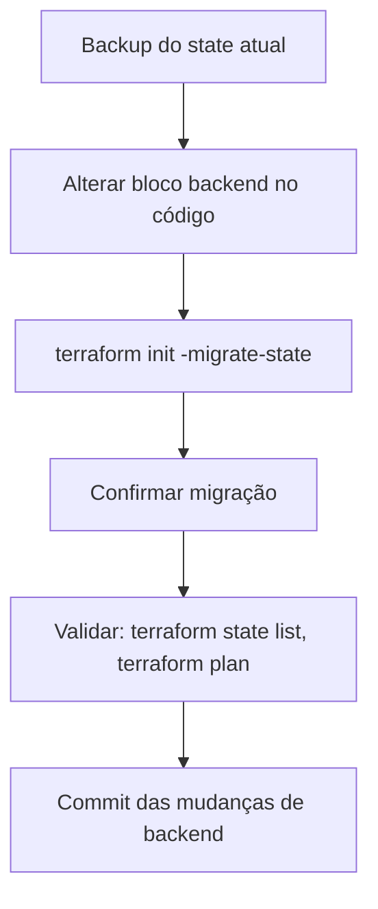

# 07_07 - Migração de Backends

Trocar backend é parte da vida do projeto Terraform: sai local, entra S3; sai S3 de uma conta, entra S3 de outra; sai `remote` (Terraform Cloud) e entra backend `http` (GitLab).

Este tópico descreve o procedimento seguro.

## Tipos de migração

1. **Local → Remoto**: primeira vez indo para um backend colaborativo.
2. **Remoto A → Remoto B**: troca de provedor (S3 → GCS, GitLab → Terraform Cloud, etc.).
3. **Dentro do mesmo backend**: mudar `key`, `bucket`, `region`.
4. **Juntar/separar states**: refatorações grandes.

Cada cenário tem nuances, mas o núcleo é o mesmo: copiar o state atual para o novo destino sem perder nada.

## Procedimento genérico



Detalhes:

### 1. Backup

```bash
terraform state pull > backup-$(date +%Y%m%d-%H%M%S).json
```

Guarde em local seguro fora do repo.

### 2. Mudar o bloco `backend`

Edite `versions.tf` (ou onde seu `terraform {}` vive):

```hcl
# Antes
terraform {
  backend "local" {
    path = "./terraform.tfstate"
  }
}

# Depois
terraform {
  backend "s3" {
    bucket         = "minha-empresa-tfstate"
    key            = "plataforma/rede/terraform.tfstate"
    region         = "us-east-1"
    dynamodb_table = "terraform-locks"
    encrypt        = true
  }
}
```

### 3. `terraform init -migrate-state`

```bash
terraform init -migrate-state
```

Terraform detecta a mudança, mostra resumo e pergunta:

```
Do you want to copy existing state to the new backend?
  Pre-existing state was found while migrating the previous "local" backend to the
  newly configured "s3" backend. No existing state was found in the newly
  configured "s3" backend. Do you want to copy this state to the new "s3" backend?
  Enter "yes" to copy and "no" to start with an empty state.

  Enter a value: yes
```

- `yes` → copia.
- `no` → **descarta** o state local e começa do zero (perigoso; só para "realmente começar limpo").

### 4. Validar

```bash
terraform state list
terraform plan
```

Espera-se:

- `state list` retorna os mesmos recursos que antes.
- `plan` mostra `No changes. Your infrastructure matches the configuration.` (se não houve drift/mudanças de código).

### 5. Commit

```bash
git add versions.tf .terraform.lock.hcl
git commit -m "chore: migrar backend para S3"
```

Informe o time para re-rodar `init`.

## Caso 1: Local → S3

Já abordado acima. Antes de migrar:

- Crie bucket, versioning, encryption, tabela DynamoDB.
- Configure credenciais AWS.

## Caso 2: S3 → S3 (mudar key/bucket)

Dois cenários:

### 2a. Mudança no mesmo bucket (apenas `key`)

```hcl
# Antes
key = "old/path/terraform.tfstate"

# Depois
key = "new/path/terraform.tfstate"
```

```bash
terraform init -migrate-state
```

Terraform lê o state do path antigo e grava no novo.

### 2b. Bucket diferente

Idem — mude `bucket` no código, `init -migrate-state`.

Garanta que a IAM do usuário/role tem permissões nos **dois** buckets durante a migração.

## Caso 3: S3 → Terraform Cloud

1. Crie a organização e workspace no HCP Terraform.
2. Altere:

```hcl
terraform {
  cloud {
    organization = "minha-empresa"
    workspaces {
      name = "plataforma-rede-prod"
    }
  }
}
```

3. `terraform login` (gera token pessoal).
4. `terraform init` → migra.

## Caso 4: Terraform Cloud → GitLab HTTP backend

Útil se sua empresa consolida em GitLab e abandona HCP Terraform:

```hcl
terraform {
  backend "http" {
    address        = "https://gitlab.com/api/v4/projects/123/terraform/state/prod"
    lock_address   = "https://gitlab.com/api/v4/projects/123/terraform/state/prod/lock"
    unlock_address = "https://gitlab.com/api/v4/projects/123/terraform/state/prod/lock"
    lock_method    = "POST"
    unlock_method  = "DELETE"
  }
}
```

Export credentials:

```bash
export TF_HTTP_USERNAME=oauth2
export TF_HTTP_PASSWORD="<GitLab token>"
```

`terraform init -migrate-state`.

## Caso 5: Sem `-migrate-state` (start from scratch)

Se quiser começar zerado no novo backend:

```bash
terraform init -reconfigure
```

Isso **descarta** tudo. Use apenas quando o state antigo não importa.

## Caso 6: Dividir um state em dois (split)

Mais complexo. Workflow:

1. Escolha os recursos que migrarão para o novo projeto.
2. No projeto NOVO, crie o backend.
3. No projeto ANTIGO, faça `terraform state pull > full.tfstate`.
4. Use `terraform state mv -state=full.tfstate -state-out=new.tfstate aws_s3_bucket.a aws_s3_bucket.a` (sintaxe específica) ou:
5. Utilize scripts / HashiCorp docs específicos para split.

Alternativa moderna:
- Use `terraform_remote_state` + `moved` blocks quando possível.
- Para splits complexos, considere ferramentas como `terraformer`/`tfmigrate`.

## Caso 7: Juntar dois states

Inverso do split. Pegue o segundo state, use `terraform state mv -state=second.tfstate -state-out=merged.tfstate ...` e depois `terraform state push merged.tfstate`.

## Erros comuns

### "Backend configuration changed"

Normal — rode `init` com `-migrate-state` ou `-reconfigure` conforme o caso.

### "State locked"

Alguém está operando. Espere ou `force-unlock` (com cuidado).

### "No state file found in the previous configuration"

O backend anterior não tinha state — nada para migrar. Use `-reconfigure`.

### "Permission denied"

IAM/credenciais insuficientes no novo backend. Confirme policies.

## Pós-migração

- [ ] Documente o novo backend no README.
- [ ] Atualize o CI com novas credenciais/paths.
- [ ] Informe o time.
- [ ] Monitore o primeiro apply pós-migração com mais atenção.
- [ ] Mantenha backup do state antigo por alguns meses.

No próximo tópico: exemplo prático de provisionar bucket + DynamoDB para backend e migrar para ele.
