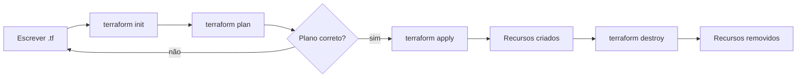

# Lab 000 - Primeiros Passos com Terraform

## Objetivo

Entender o ciclo básico do Terraform escrevendo seus primeiros arquivos de configuração e executando os comandos essenciais: `init`, `plan`, `apply` e `destroy`.

## Duração e dificuldade

- Duração estimada: 15 a 25 minutos
- Dificuldade: iniciante

## Pré-requisitos

- [Terraform](https://developer.hashicorp.com/terraform/install) instalado (versão 1.0+)

Nenhuma conta de cloud, Docker ou dependência externa é necessária. Tudo roda localmente.

Verifique se o Terraform está instalado:

```bash
terraform version
```

## O que este lab faz

Usa o **provider `local`** do Terraform para criar um arquivo de texto na sua máquina. Simples assim — sem cloud, sem credenciais. O foco é no fluxo e nos conceitos, não na infraestrutura.

## Conceitos abordados

| Conceito | O que é |
|---|---|
| **Provider** | Plugin que conecta o Terraform a um sistema (AWS, GCP, local...) |
| **Resource** | Recurso que o Terraform vai criar e gerenciar |
| **Variable** | Valor parametrizável para tornar o código reutilizável |
| **Output** | Valor que o Terraform exibe ao final do `apply` |
| **State** | Arquivo `terraform.tfstate` que registra o que foi criado |

## Estrutura dos arquivos

```
lab-000-terraform-primeiros-passos/
├── main.tf           # Configuração principal: provider e recursos
├── variables.tf      # Declaração das variáveis
├── outputs.tf        # O que será exibido após o apply
├── terraform.tfvars  # Valores das variáveis para este ambiente
└── output/           # Pasta onde o Terraform criará o arquivo
```

## Passo a passo

### 1. Clone o repositório e acesse o lab

```bash
git clone https://github.com/toolbox-playground/terraform-dominando-iac.git
cd terraform-dominando-iac/labs/lab-000-terraform-primeiros-passos
```

### 2. Explore os arquivos antes de executar qualquer comando

Abra cada arquivo e leia o conteúdo. Tente responder:

- O que o `resource "local_file" "mensagem"` vai criar?
- Qual é o valor da variável `mensagem` definida em `terraform.tfvars`?
- O que o `output "caminho_arquivo"` vai exibir?

---

### 3. `terraform init` — inicializar o projeto

```bash
terraform init
```

O que acontece:
- O Terraform lê o `main.tf` e identifica os providers necessários (`hashicorp/local`).
- Baixa o plugin do provider na pasta `.terraform/`.
- Cria o arquivo `.terraform.lock.hcl` com as versões fixadas.

Após rodar, observe o que foi criado:

```bash
ls -la
ls .terraform/
```

---

### 4. `terraform plan` — planejar sem aplicar nada

```bash
terraform plan
```

O que acontece:
- O Terraform compara o estado atual (nenhum recurso ainda) com o que está no código.
- Exibe um plano mostrando o que será **criado** (`+`), **modificado** (`~`) ou **destruído** (`-`).
- **Nada é criado ainda.**

Leia o output com atenção. Você deve ver algo como:

```
+ resource "local_file" "mensagem" {
    + content  = "Olá, Terraform! Este arquivo foi criado via IaC."
    + filename = "./output/meu-primeiro-arquivo.txt"
    ...
}

Plan: 1 to add, 0 to change, 0 to destroy.
```

---

### 5. `terraform apply` — aplicar a infraestrutura

```bash
terraform apply
```

O Terraform vai exibir o plano novamente e pedir confirmação. Digite `yes` e pressione Enter.

```
Do you want to perform these actions?
  Enter a value: yes
```

Após a execução, verifique:

```bash
# O arquivo foi criado?
cat output/meu-primeiro-arquivo.txt

# O state foi criado?
cat terraform.tfstate
```

Os **outputs** também serão exibidos no terminal:

```
Outputs:

caminho_arquivo  = "./output/meu-primeiro-arquivo.txt"
conteudo_arquivo = "Olá, Terraform! Este arquivo foi criado via IaC."
```

---

### 6. Modifique uma variável e re-aplique

Edite o arquivo `terraform.tfvars` e mude a mensagem:

```hcl
mensagem = "Infraestrutura como código é poderoso!"
```

Rode `plan` novamente e observe a diferença:

```bash
terraform plan
```

Você verá `~` indicando uma **modificação** no lugar de `+` (criação). Aplique:

```bash
terraform apply
```

Confirme que o arquivo foi atualizado:

```bash
cat output/meu-primeiro-arquivo.txt
```

---

### 7. `terraform destroy` — destruir tudo

```bash
terraform destroy
```

Digite `yes` para confirmar. O Terraform remove todos os recursos que ele gerencia.

Verifique:

```bash
# O arquivo sumiu?
ls output/

# O state agora está vazio
cat terraform.tfstate
```

---

## Diagrama do ciclo



## Resumo dos comandos

| Comando | O que faz |
|---|---|
| `terraform init` | Inicializa o projeto e baixa providers |
| `terraform plan` | Mostra o que será feito sem executar |
| `terraform apply` | Cria ou atualiza a infraestrutura |
| `terraform destroy` | Remove todos os recursos gerenciados |
| `terraform show` | Exibe o estado atual |
| `terraform output` | Exibe os outputs sem precisar de apply |

## Dicas práticas

- **Sempre rode `plan` antes de `apply`** — é sua chance de revisar o que vai acontecer.
- O arquivo `terraform.tfstate` é o "inventário" do Terraform. Nunca edite manualmente.
- O diretório `.terraform/` e o arquivo `.tfstate` **não devem ser commitados** junto com o código — em projetos reais, o state fica em um backend remoto (S3, Terraform Cloud).
- Se quiser aprovar sem digitar `yes`, use `terraform apply -auto-approve` (evite em produção).

## Próximo passo

Agora que você domina o ciclo básico, o **Lab 001** usa o mesmo fluxo para provisionar recursos AWS reais simulados com LocalStack.
