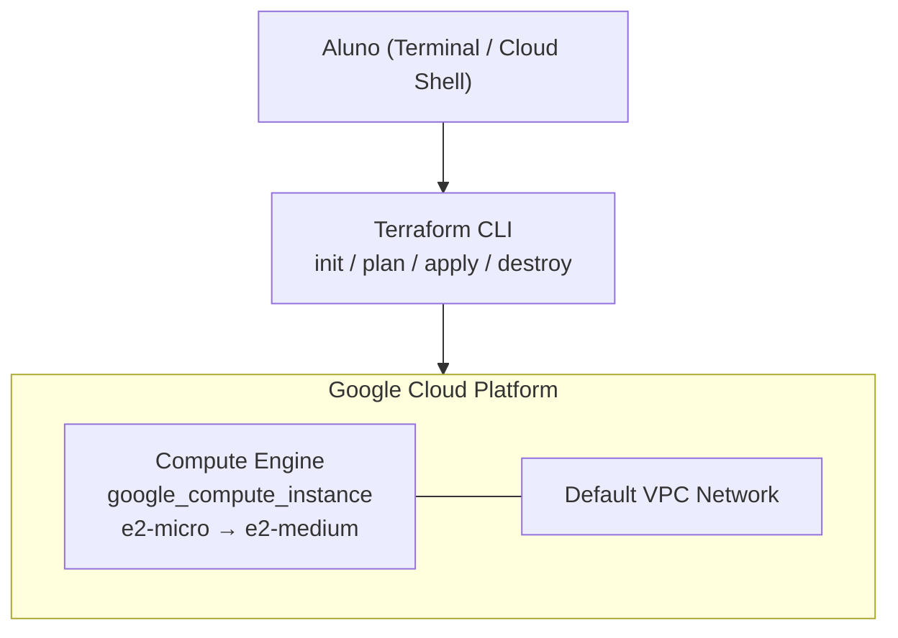

# Lab 001 - Terraform com GCP

## Objetivo

Provisionar uma instância Compute Engine no Google Cloud usando Terraform, praticando o ciclo completo de IaC: `init`, `plan`, `apply`, modificação e `destroy`.

## Duração e dificuldade

- Duração estimada: 20 a 35 minutos
- Dificuldade: iniciante

## Referência do exercício

Este lab é baseado no lab oficial do Google Skills:
- [Infrastructure as Code with Terraform — Google Skills #4981](https://www.skills.google/catalog_lab/4981)

## Pré-requisitos

- Conta GCP com um projeto ativo e billing habilitado
- [Terraform](https://developer.hashicorp.com/terraform/install) instalado (versão 1.0+)
- [gcloud CLI](https://cloud.google.com/sdk/docs/install) autenticado, **ou** use o Google Cloud Shell (Terraform já vem pré-instalado)

Autentique o Terraform com sua conta GCP:

```bash
gcloud auth application-default login
```

> Para encontrar o `project_id`: Console GCP → selecione o projeto → o ID aparece no topo da página (diferente do nome do projeto).

## Estrutura dos arquivos

```
lab-001-terraform-gcp/
├── main.tf           # Provider google + resource google_compute_instance
├── variables.tf      # Declaração das variáveis
├── outputs.tf        # IP, nome e zona da instância criada
└── terraform.tfvars  # Preencha com seu project_id antes de rodar
```

## Passo a passo

### 1. Clone o repositório e acesse o lab

```bash
git clone https://github.com/toolbox-playground/terraform-dominando-iac.git
cd terraform-dominando-iac/labs/lab-001-terraform-gcp
```

### 2. Preencha o `terraform.tfvars`

Edite o arquivo e substitua `SEU-PROJECT-ID-AQUI` pelo ID real do seu projeto:

```hcl
project_id = "meu-projeto-123"
```

---

### 3. `terraform init`

```bash
terraform init
```

O que acontece: o Terraform baixa o provider `hashicorp/google` (~50MB). Observe a pasta `.terraform/` criada.

---

### 4. `terraform plan`

```bash
terraform plan
```

Leia o output. Você deve ver a criação de `google_compute_instance.vm_instance` com `machine_type = e2-micro`.

---

### 5. `terraform apply`

```bash
terraform apply
```

Digite `yes` para confirmar. Após a execução, o output exibirá:

```
instance_ip   = "XX.XX.XX.XX"
instance_name = "terraform-instance"
instance_zone = "us-central1-a"
machine_type  = "e2-micro"
```

Confirme no Console GCP: **Compute Engine → Instâncias de VM**.

---

### 6. Modifique e re-aplique

Edite o `terraform.tfvars` com duas mudanças:

```hcl
machine_type = "e2-medium"
tags         = ["web", "dev"]
```

Rode o plan e observe os símbolos `~` (update in-place):

```bash
terraform plan
terraform apply
```

---

### 7. `terraform destroy`

```bash
terraform destroy
```

Digite `yes`. Confirme no Console GCP que a instância foi removida.

> Importante: sempre destrua os recursos ao final do lab para evitar cobranças.

---

## Diagrama da arquitetura



## Resumo dos conceitos praticados

| Conceito | O que foi feito |
|---|---|
| **Provider** | `hashicorp/google` autenticado via `gcloud` |
| **Resource** | `google_compute_instance` com boot disk e interface de rede |
| **Variables** | `project_id`, `machine_type`, `tags` parametrizáveis |
| **Outputs** | IP externo, nome e zona da instância |
| **Update** | Mudança de `machine_type` sem recriar (graças a `allow_stopping_for_update`) |
| **Destroy** | Remoção limpa de todos os recursos |

## Dicas práticas

- Sempre rode `plan` antes do `apply` — especialmente em contas reais com custo.
- O `allow_stopping_for_update = true` permite que o Terraform pare e religue a VM para aplicar mudanças de tipo de máquina sem recriar o recurso.
- Em produção, o `project_id` nunca vai no `tfvars` commitado — use variáveis de ambiente ou um backend remoto.
